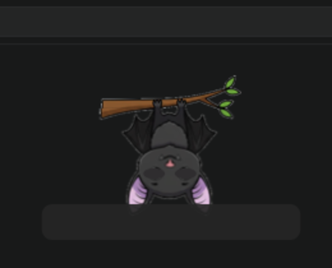
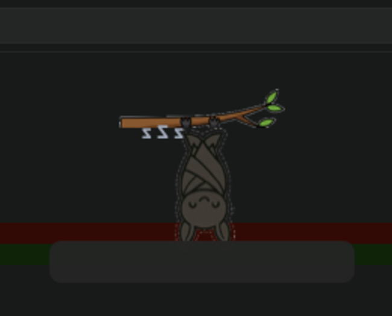
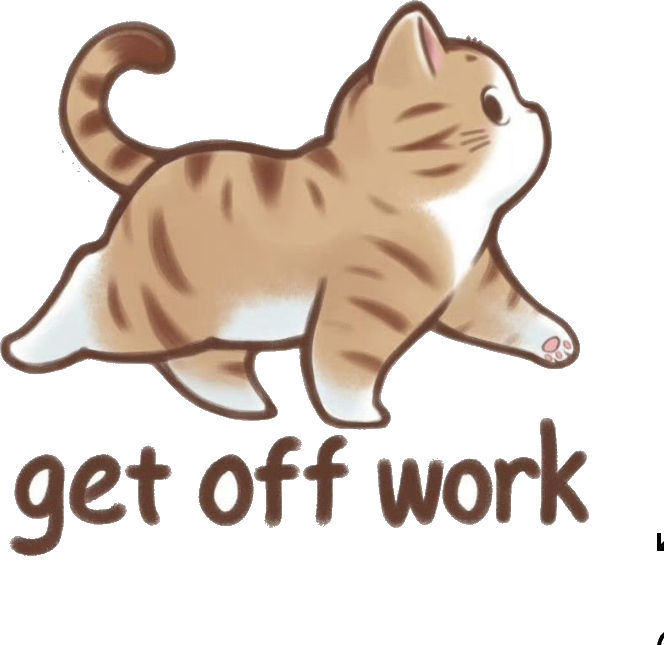

# Wigbat 🦇

A tiny buddy that lives tucked at the top of your screen. It keeps your Mac
awake while something you care about is running — a Claude Code session, an app
you choose, or any command — and lets it sleep the moment you're done. No more
losing a long-running job because the lid dimmed the screen.

| Awake | Asleep |
|---|---|
|  |  |

### Pick your mascot

Right-click → **Mascot** to switch character. The bat hangs from its branch;
the cat reacts to what's happening — hunches over the laptop when something
needs you, chills while idle, and strolls off ("get off work") when keep-awake
ends.

| Idle | Working | Asleep | Clocking off |
|---|---|---|---|
|  |  |  |  |

Mascots are **data-driven** — drop an `assets/mascots/<name>/` folder with a
`mascot.json` and pose PNGs and it shows up in the picker automatically, no
code changes.

## What it does

- **Keeps the Mac awake for whatever you care about.** Three sources can hold
  keep-awake, and the buddy stays awake if *any* of them wants it:
  - **Claude Code sessions** — a `SessionStart` hook turns keep-awake on and
    `SessionEnd` turns it off. Concurrent sessions are ref-counted.
  - **Apps you choose** — right-click → **Keep Awake While Running** and tick
    apps (Blender, ffmpeg host, a download manager, an export…). The Mac stays
    awake while any of them is running.
  - **Any command** — `wigbat run -- <cmd>` holds keep-awake for the duration
    of a command and pops a bubble when it finishes.
- **Works with or without Claude Code.** If you don't use Claude, the app
  watcher and the `wigbat` CLI give you the whole feature set on their own.
- **Self-heals.** A once-a-second reconciler forces sleep only when *nothing*
  wants to stay awake, so a force-quit session (whose `SessionEnd` never fired)
  can't strand the Mac awake.
- **Hides until you need it.** Tucked at the top of the screen; hover near the
  top edge and it slides fully into view. Move away and it tucks itself back in.
- **One click to override.** Left-click the buddy any time to force the Mac
  awake or let it sleep, regardless of what the sources are doing. The override
  sticks until the sources agree with it again.
- **Pops up for attention.** When Claude Code needs you (the `Notification`
  hook) or any tool calls `wigbat notify`, the buddy springs out with an
  excited shake, plays a soft chirp (toggleable), and shows the message in a
  speech bubble for 15 seconds. Click the bubble to dismiss it early.
- **Sleep-safety timer.** Optional hard cap (2/4/8 hours) on how long
  keep-awake can run, no matter what the sources or hooks are doing — so a
  runaway job can't drain your battery overnight.
- **Recent messages.** Both menus keep the last few notifications with
  timestamps, so a missed bubble isn't gone forever.
- **Drag it anywhere — on any display.** Free-hand positioning; the buddy
  remembers which screen you dropped it on and stays there across monitor
  plug/unplug (falling back to the main display).
- **Menu bar icon** as a second, always-reachable control surface, independent
  of the floating buddy. Its icon reflects the selected mascot.
- **Battery-friendly option** — "Keep Display On" toggle: turn it off and the
  screen is allowed to sleep while the Mac itself stays awake
  (`caffeinate -imsu` instead of `-dimsu`).

## The `wigbat` CLI

Installed onto your `PATH` by `install.sh`, so any script or app can drive the
buddy — no Claude needed:

```
wigbat notify "Backup finished"     # pop a speech bubble (chirps too)
wigbat on                           # keep the Mac awake until you say otherwise
wigbat off                          # let it sleep (overrides other sources)
wigbat auto                         # drop the manual override, follow the sources
wigbat run -- make release          # stay awake while the command runs, notify at the end
```

There's also a URL scheme for GUI apps, Shortcuts, and Automator:

```
open "wigbat://notify?message=Render%20done"
open "wigbat://on"    open "wigbat://off"    open "wigbat://auto"
```

## Controls

- **Left-click** the buddy — toggle keep-awake manually
- **Click** the speech bubble — dismiss it
- **Drag** the buddy — move it anywhere, on any display
- **Right-click** the buddy — menu: Keep Mac Awake ✓, Keep Display On ✓,
  Keep Awake While Running ▸, Sleep-Safety Timer ▸, Chirp on Notifications ✓,
  Mascot ▸, Recent Messages ▸, Hide, Bigger/Smaller, Rotate Left/Right,
  Reset Position, Help, Quit
- **Menu bar icon** — same menu, plus Show/Hide Buddy

## Opening & relaunching it

You normally never launch Wigbat by hand — `install.sh` starts it and a
LaunchAgent auto-launches it at every login (and auto-restarts it if it
crashes). While running it shows up **only** as the menu-bar icon and the
floating buddy — there's deliberately no Dock icon, since it's an accessory app.

The one time you need to reopen it is after you've chosen **Quit** from its
menu. Because it's installed as `/Applications/Wigbat.app`, you can reopen it
however you like: Spotlight (⌘-Space → "Wigbat"), double-click in
`/Applications`, drag it into the Dock, or `open -a Wigbat` in a terminal.

Only one buddy ever runs at a time — a single-instance `flock` guards against
duplicates.

## How it's built

- `bin/stayawake`, `bin/killawake` — the actual caffeinate wrapper scripts,
  usable standalone from the terminal too. Both write current state to
  `state/state.json` so the app can reflect it.
- `bin/wigbat` — the universal CLI (notify / on / off / auto / run). `run`
  keeps a ref-counted `state/run-count` so concurrent commands compose.
- `bin/hook-session-start.sh`, `bin/hook-session-end.sh` — ref-counting
  wrappers called by Claude Code's hooks (see `~/.claude/settings.json`).
- `bin/hook-notification.sh` — called by the `Notification` hook, stashes the
  message into `state/message.json` for the buddy's speech bubble.
- `swift/BuddyApp.swift` — the floating buddy, a small AppKit app (no Xcode
  project needed, just `swiftc`). Runs as an `.accessory` app, floats above all
  apps and full-screen Spaces. A 1s reconciler decides keep-awake from all
  sources plus the manual override (`state/override`), and it registers the
  `wigbat://` URL scheme.
  - **Mascots** are loaded from `assets/mascots/<id>/mascot.json`. The bat is a
    built-in with a bespoke branch/blink/ear-wiggle renderer; every other
    mascot uses the generic pose-swap renderer (asleep / awake / working /
    awake-alt / leaving).
- `bin/make-app.sh` — compiles the binary and packages
  `/Applications/Wigbat.app` (icon + `Info.plist` with `LSUIElement` and the
  `wigbat` URL scheme). Assets and state are read from `~/claude-awake-buddy`.
- `assets/` — the bat artwork; `assets/mascots/` — additional mascots.
- `~/Library/LaunchAgents/com.wigbat.buddy.plist` — keeps the app running.

## Installing on another Mac

Requires the Xcode Command Line Tools (`xcode-select --install`) for `swiftc`.
`jq` is used for the Claude-hook merge and `wigbat notify` (falls back to
`python3`). Preparing new mascot art from screenshots uses ImageMagick
(`brew install imagemagick`) — not needed to run the app.

One command — clone, enter, and install in one go:

```
git clone https://github.com/mohammadsaadshafiq/StayAwake.git ~/claude-awake-buddy && cd ~/claude-awake-buddy && ./install.sh
```

Or step by step, if you prefer:

```
git clone https://github.com/mohammadsaadshafiq/StayAwake.git ~/claude-awake-buddy
cd ~/claude-awake-buddy
./install.sh
```

`install.sh` compiles the app, symlinks the `wigbat` CLI onto your `PATH`,
writes a LaunchAgent, and starts it. If Claude Code is present it also merges
the `SessionStart`/`SessionEnd`/`Notification` hooks into
`~/.claude/settings.json` (backing up the original first, safe to re-run); if
not, it skips that step and you use the app-watcher and CLI instead. Restart
any open Claude Code sessions afterward so the new hooks take effect.

## Notes & limitations

- The buddy's floating window is a small fixed hit-zone near the top of the
  screen — dragging or right-clicking there will intercept clicks meant for
  whatever's underneath, same as any menu-bar dropdown would.
- Position/scale/tilt/mascot/watched-apps are saved per-Mac in
  `state/prefs.json`, not synced anywhere.
- The bundled cat art is third-party sticker art included for personal use —
  swap in your own art before distributing.
- Not yet packaged for Homebrew or as a distributable Claude Code skill.
